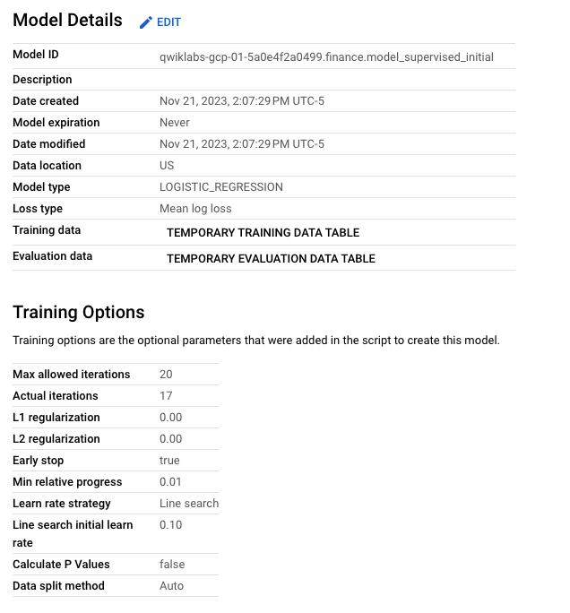
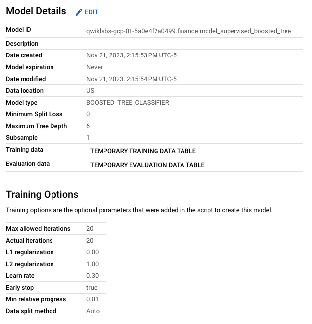

# Fraud Detection on Financial Transactions with Machine Learning on Google Cloud

## Project Overview
This project explores the use of BigQuery ML to detect fraudulent activities in financial transactions. Utilizing public financial transaction data, the project applies feature engineering and machine learning techniques, including both supervised and unsupervised models, to identify fraudulent transactions.

_Screenshot: BigQuery Interface with Financial Transactions Data_

## Objective
 - To develop a robust model capable of detecting fraud in financial transactions using machine learning techniques.
 - To demonstrate the application of BigQuery ML and Google Cloud tools in analyzing large datasets for anomaly detection.

## Methodology
 - **Data Exploration and Preparation:** Analyzing financial transactions data and preparing it for machine learning models.
 - **Feature Engineering:** Creating new features to enhance model performance.
 - **Model Development:**
	 - Unsupervised Model: Implementing k-means clustering for anomaly detection.
	 - Supervised Models: Building logistic regression and boosted tree models for fraud detection.
 
_Screenshot: Kmeans Model (Unsupervised)_

 

_Screenshot: Logistic Regression Model (Supervised)_

 

_Screenshot: Boosted Tree Model (Supervised)_

## Key Findings
 - Insights into patterns and anomalies in financial transactions that indicate fraudulent activities.
 - Evaluation of different machine learning models to determine their effectiveness in fraud detection.

## Conclusion
This project illustrates the power of machine learning and BigQuery ML in detecting fraudulent activities in financial transactions. The methodologies and tools employed showcase a practical approach to tackling real-world problems in the financial sector using advanced analytics.
